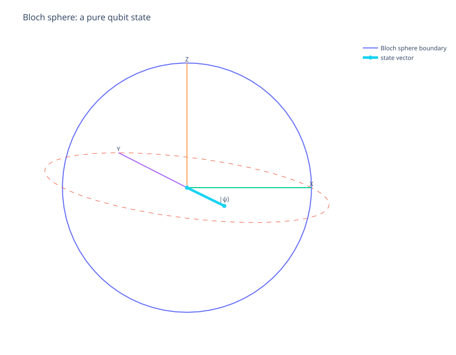
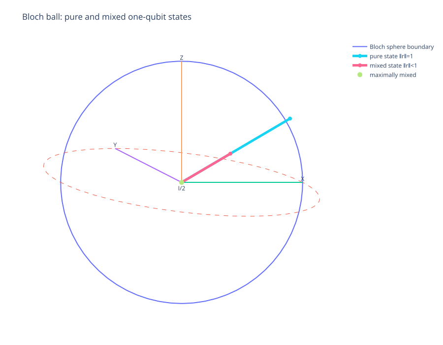
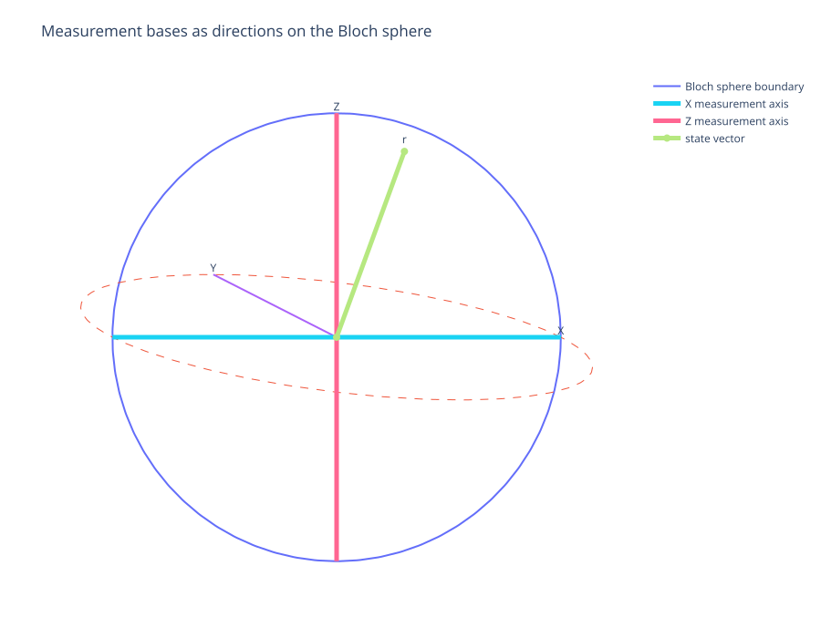
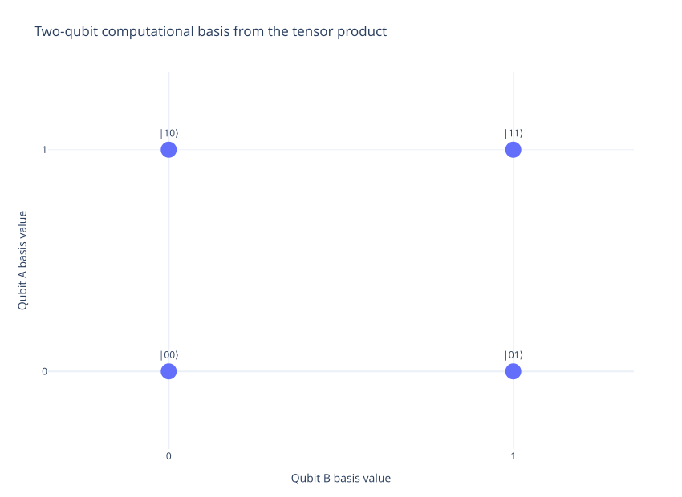
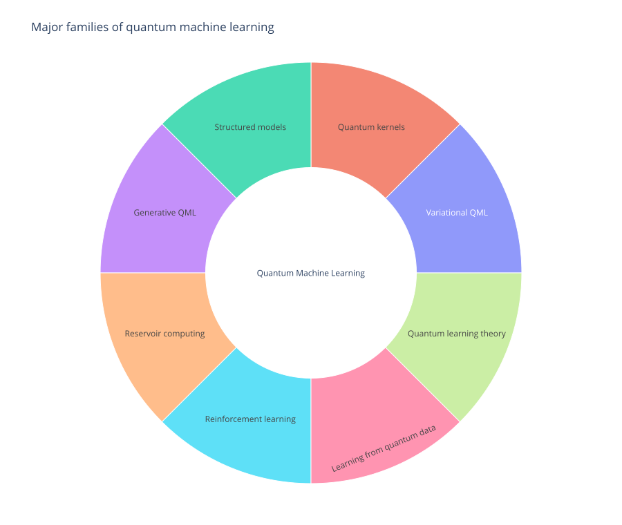

# Educational Figures

These figures are generated with **Plotly** for the educational chapters in this repository.

The goal is explanatory rather than decorative: each figure is used where geometry, state-space structure, or a taxonomy is easier to understand visually. SVG is used so the figures render sharply on GitHub at different zoom levels.

## Bloch sphere: pure qubit state

A pure qubit is represented by a unit Bloch vector. Its Cartesian coordinates are the expectation values of the Pauli observables $X$, $Y$, and $Z$.

Best read with [The Bloch Sphere](../../01-foundations/04-bloch-sphere.md).

## Bloch ball: pure and mixed states

Pure one-qubit states lie on the surface of the Bloch sphere. Mixed states lie inside the Bloch ball, and the maximally mixed state $I/2$ sits at the origin.

Best read with [The Bloch Sphere](../../01-foundations/04-bloch-sphere.md) and [Density Matrices and Mixed States](../../01-foundations/07-density-matrices.md).

## Measurement axes

A projective qubit measurement can be viewed geometrically as choosing an axis. The angle between the state vector and measurement axis controls the outcome probabilities.

Best read with [The Bloch Sphere](../../01-foundations/04-bloch-sphere.md) and [Measurements and POVMs](../../01-foundations/08-measurements-and-povms.md).

## Two-qubit tensor-product basis

The tensor product of two two-dimensional qubit spaces produces a four-dimensional joint state space with computational basis $|00\rangle$, $|01\rangle$, $|10\rangle$, and $|11\rangle$.

Best read with [Composite Systems and Tensor Products](../../01-foundations/05-composite-systems.md).

## QML taxonomy

Quantum machine learning is a broad field. Variational QML is one branch alongside quantum kernels, structured models, generative methods, reservoir computing, reinforcement learning, quantum-data learning, and quantum learning theory.

Best read with [Quantum Machine Learning](../../07-quantum-machine-learning/README.md).

## Figure policy

A figure is added when it helps the reader understand a mathematical or conceptual relationship that would otherwise require substantial prose. Decorative graphics are intentionally avoided.