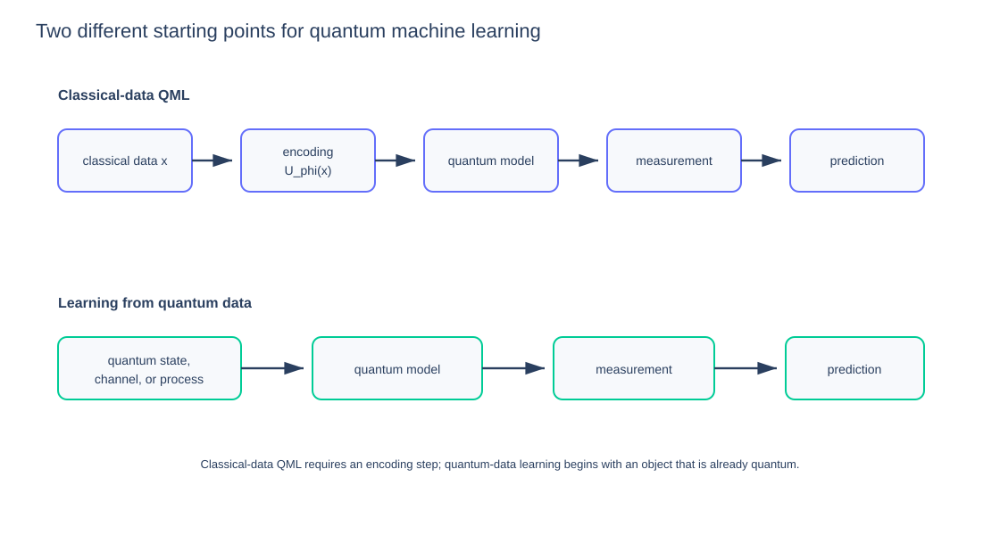

# Educational Figures

These figures are generated with **Plotly** and then optimized as lightweight static SVGs for reliable rendering on GitHub.

The goal is explanatory rather than decorative: each figure is used where geometry, state-space structure, probability distributions, correlations, or an algorithmic flow is easier to understand visually.

## Foundations

### Bloch sphere: pure qubit state

A pure qubit is represented by a unit Bloch vector. Its Cartesian coordinates are the expectation values of the Pauli observables $X$, $Y$, and $Z$.

Best read with [The Bloch Sphere](../../01-foundations/04-bloch-sphere.md).

### Bloch ball: pure and mixed states

Pure one-qubit states lie on the surface of the Bloch sphere. Mixed states lie inside the Bloch ball, and the maximally mixed state $I/2$ sits at the origin.

Best read with [The Bloch Sphere](../../01-foundations/04-bloch-sphere.md) and [Density Matrices and Mixed States](../../01-foundations/07-density-matrices.md).

### Measurement axes

A projective qubit measurement can be viewed geometrically as choosing an axis. The angle between the state vector and measurement axis controls the outcome probabilities.

Best read with [The Bloch Sphere](../../01-foundations/04-bloch-sphere.md) and [Measurements and POVMs](../../01-foundations/08-measurements-and-povms.md).

### Two-qubit tensor-product basis

The tensor product of two two-dimensional qubit spaces produces a four-dimensional joint state space with computational basis $|00\rangle$, $|01\rangle$, $|10\rangle$, and $|11\rangle$.

Best read with [Composite Systems and Tensor Products](../../01-foundations/05-composite-systems.md).

### Bell entanglement versus classical correlation

A Bell state and a classically correlated mixture can both have perfect $Z\otimes Z$ correlation. Measuring a complementary observable such as $X\otimes X$ distinguishes the two: correlation in one basis is not enough to establish entanglement.

Best read with [Entanglement](../../01-foundations/06-entanglement.md).

## Quantum algorithms

### Grover rotation

Grover search evolves inside a two-dimensional good/bad subspace. Each Grover iterate rotates the state by $2\theta$ toward the good-state direction.

Best read with [Grover Search and Amplitude Amplification](../../04-quantum-algorithms/02-grover.md).

### Quantum phase estimation distribution

If the target phase cannot be represented exactly with the available control qubits, QPE does not return one deterministic bit string. Instead, probability concentrates around the closest binary approximations.

Best read with [Quantum Phase Estimation](../../04-quantum-algorithms/03-phase-estimation.md).

## Variational quantum algorithms

### Hybrid variational loop

A VQA repeatedly evaluates a quantum objective, passes the result to a classical optimizer, updates circuit parameters, and executes the circuit again.

Best read with [Variational Principle and Hybrid Loop](../../05-variational-quantum-algorithms/02-variational-principle.md).

## Quantum machine learning

### QML taxonomy

Quantum machine learning is a broad field. Variational QML is one branch alongside quantum kernels, structured models, generative methods, reservoir computing, reinforcement learning, quantum-data learning, and quantum learning theory.

Best read with [Quantum Machine Learning](../../07-quantum-machine-learning/README.md).

### Classical-data QML versus quantum-data learning

Classical-data QML begins with classical information that must be encoded into a quantum representation. Quantum-data learning begins with a state, channel, Hamiltonian, or process that is already quantum.

Best read with [What Is Quantum Machine Learning?](../../07-quantum-machine-learning/01-what-is-qml.md).

## Figure policy

A figure is added when it clarifies a mathematical or conceptual relationship that would otherwise require substantial prose. Decorative graphics are intentionally avoided.

The static SVGs are optimized for GitHub. Interactive Plotly versions can be introduced later in a web edition without changing the chapter structure.